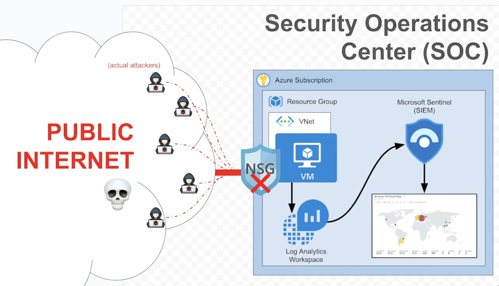
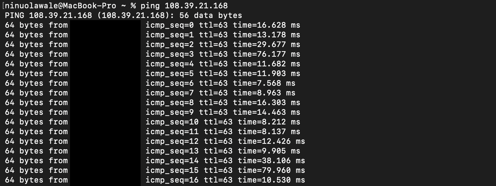
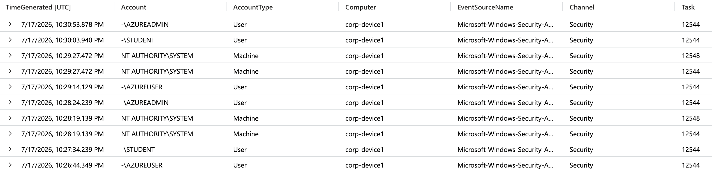
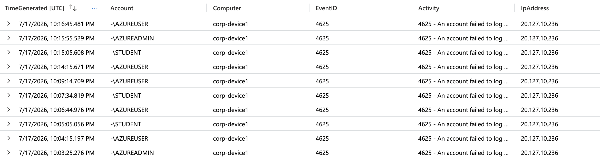
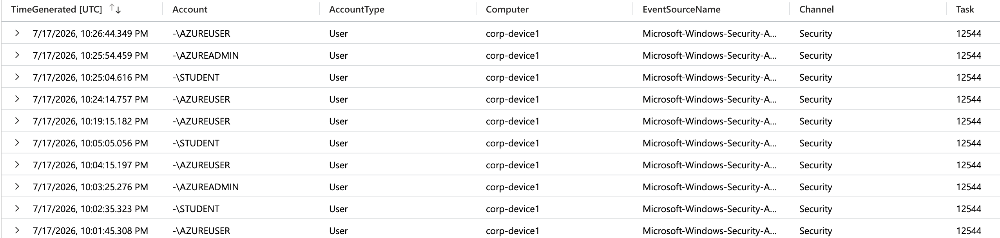
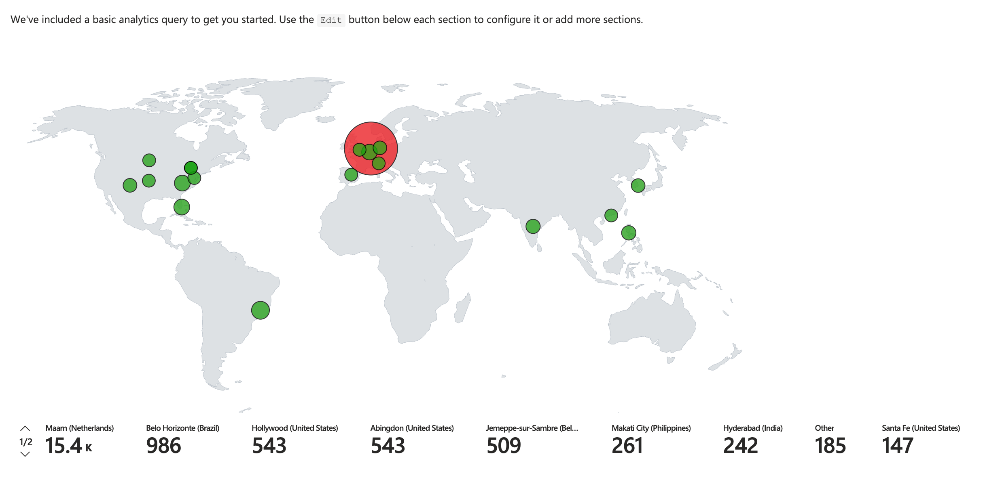
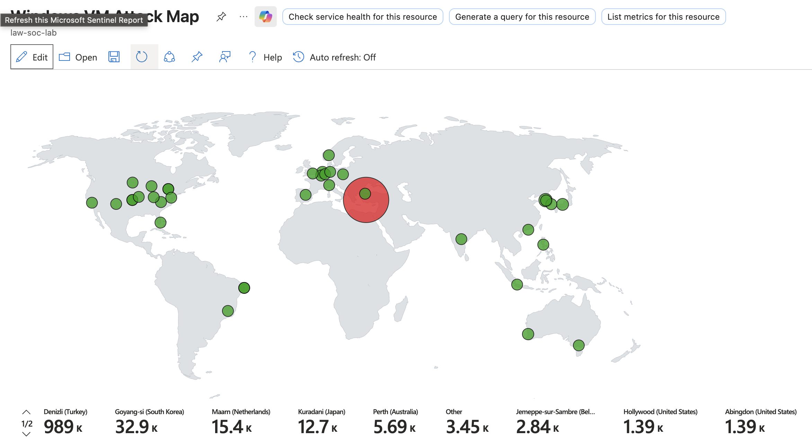

# Azure Sentinel Homelab: RDP Brute-Force Honeypot Detection



# Detection Report: Unauthorized RDP Brute-Force Attempts

## Platforms and Languages Leveraged
- Windows Virtual Machine (Microsoft Azure)
- SIEM Platform: Microsoft Sentinel
- Log Analytics Workspace / Azure Monitor Agent (AMA)
- Kusto Query Language (KQL)
- PowerShell (log capture, IP enrichment, structured output)
- ipgeolocation.io API (IP geolocation enrichment)

## Scenario

Exposing a Windows VM directly to the internet with an open Network Security Group (NSG) rule and a disabled host firewall is a well-known way to attract automated RDP brute-force attempts from real-world attackers. The goal of this project was to intentionally build this exposure as a **honeypot**, capture the resulting failed logon attempts (Event ID 4625), enrich the source IPs with geolocation data, and visualize attacker origin on a live map inside Microsoft Sentinel — essentially building a small-scale SOC detection pipeline from the ground up, from raw exposure to an analyst-facing dashboard.

### High-Level Detection Build Plan

- **Deploy** an intentionally exposed Windows VM (open NSG inbound rule, host firewall disabled) to act as bait.
- **Verify** exposure and reachability, then confirm failed RDP logons are generating locally in Event Viewer (Event ID 4625).
- **Centralize** logs into a Log Analytics Workspace via the AMA connector and a Data Collection Rule (DCR), ingested into Microsoft Sentinel.
- **Query** the resulting data in Sentinel using KQL to confirm log flow and filter down to relevant security events (Event ID 4625).
- **Enrich** attacking IPs with geolocation data using a Sentinel Watchlist and the `ipv4_lookup()` KQL function.
- **Visualize** attacker origin and volume on a Sentinel Workbook heatmap, built from live honeypot data.

---

## Steps Taken

### 1. Deployed the Exposed VM Infrastructure

Built the environment from scratch: created a Resource Group, Virtual Network, and Windows VM. Added an NSG inbound rule allowing all traffic, then connected via RDP and disabled Windows Defender Firewall on the host. This combination was a deliberate design choice — not an oversight — to maximize the honeypot's external visibility to internet scanners and automated attack tools.

A ping test from an external host confirmed the VM was reachable, and Event Viewer was checked locally to confirm failed logon events (Event ID 4625) were already being generated by unsolicited RDP attempts.



---

### 2. Centralized Logs Into Microsoft Sentinel

Created a Log Analytics Workspace and connected it to a new Microsoft Sentinel instance. Enabled the **Windows Security Events via AMA** connector and configured a Data Collection Rule (DCR) to forward Windows Security event logs from the VM into the workspace.

**Query used to confirm initial log flow:**

```kql
SecurityEvent
| where Computer == "<vm-name>"
| order by TimeGenerated desc
```



---

### 3. Refined KQL to Isolate Failed RDP Logons

Once general log flow was confirmed, the query was narrowed to focus specifically on failed logon events (Event ID 4625) relevant to the honeypot's purpose.

**Query used to isolate Event ID 4625:**

```kql
SecurityEvent
| where EventID == 4625
| project TimeGenerated, Account, Computer, EventID, Activity, IpAddress
| order by TimeGenerated
```



---

### 4. Enriched Attacker IPs With a Sentinel Watchlist

Uploaded a custom geo-IP dataset (IP ranges mapped to city, country, and latitude/longitude) as a **Sentinel Watchlist** — Sentinel's built-in feature for joining reference data against log queries. This replaced the need for a live external API call at query time, since the lookup table lives directly in the workspace.

**Enrichment query, joining failed logons against the geoip Watchlist:**

```kql
let GeoIPDB_FULL = _GetWatchlist("geoip");
let WindowsEvents = SecurityEvent
    | where EventID == 4625
    | order by TimeGenerated desc
    | evaluate ipv4_lookup(GeoIPDB_FULL, IpAddress, network);
WindowsEvents
```



An early PowerShell-based enrichment pipeline (capturing 4625 events locally and calling the ipgeolocation.io API directly) was also built during development. Notable fixes along the way included correcting an Azure Monitor ingestion error caused by a field literally named `timestamp` — Azure Monitor requires the field to be named **`TimeGenerated`**, formatted in ISO 8601 UTC — and switching to pretty-printed JSON array output. This approach was ultimately superseded by the Watchlist + `ipv4_lookup()` method above, which is native to Sentinel and doesn't depend on an external API at query time.

---

### 5. Built a Live Attack Map in a Sentinel Workbook

Built a **Sentinel Workbook** combining the enrichment query into a heatmap-style world map: each point is sized and color-graded (green → red) by `FailureCount`, and labeled with a "City (Country)" string for quick readability.

Populated with live honeypot data, the map confirmed **over 30,000 brute-force RDP login attempts**, visualized by geographic origin — turning raw failed-logon noise into an at-a-glance picture of where attack traffic is actually coming from.

**Map after ~12 hours of exposure:**



**Map after ~36 hours of exposure:**



A second, single-IP drill-down query was also built for investigating a specific attacker's full activity once flagged from the map.

---

## Timeline of Build Events

### 1. Infrastructure Deployment
- **Event:** Resource Group, Virtual Network, and Windows VM deployed; NSG configured with an open inbound rule.
- **Action:** Infrastructure provisioning complete.

### 2. Host Exposure Confirmed
- **Event:** Windows Defender Firewall disabled on the host; external ping test successful.
- **Action:** Honeypot reachable from the internet.

### 3. Local Failed Logon Verification
- **Event:** Event Viewer confirmed Event ID 4625 entries generated by unsolicited RDP attempts.
- **Action:** Baseline honeypot activity confirmed locally.

### 4. Sentinel Pipeline Established
- **Event:** Log Analytics Workspace and Sentinel instance created; AMA connector and DCR configured.
- **Action:** Windows Security Events flowing into Sentinel.

### 5. KQL Verification and Filtering
- **Event:** Initial KQL queries confirmed log ingestion; queries refined to isolate Event ID 4625.
- **Action:** Detection query finalized.

### 6. Geo-IP Enrichment via Watchlist
- **Event:** Custom geoip Watchlist uploaded to Sentinel; KQL query built using `ipv4_lookup()` to join failed logons against it.
- **Action:** Attacking IPs resolved to real-world city/country/coordinates.

### 7. Attack Map Visualization Completed
- **Event:** Sentinel Workbook built with a heatmap world map driven by the enrichment query; live data confirmed over 30,000 captured brute-force attempts.
- **Action:** End-to-end pipeline complete — from exposure, to detection, to enriched, visualized data.

---

## Summary

This project built an intentionally exposed Windows VM honeypot to capture real-world RDP brute-force attempts, centralized those logs into Microsoft Sentinel via the AMA connector and a custom Data Collection Rule, and enriched attacking IPs with geolocation data using a Sentinel Watchlist and the `ipv4_lookup()` KQL function. That enriched data now powers a live Sentinel Workbook heatmap, which has captured and visualized **over 30,000 brute-force RDP login attempts** by geographic origin. Along the way, several real troubleshooting issues were resolved, including an Azure Monitor field-naming requirement (`TimeGenerated`) and a shift from an external API-based enrichment approach to a native Sentinel Watchlist. The result is a complete, end-to-end detection pipeline: from raw exposure, to log generation, to centralized SIEM visibility, to a live, analyst-facing attack map.

---

## Lessons Learned

- Azure Monitor rejects a field literally named `timestamp` — it must be named `TimeGenerated` and formatted in ISO 8601 UTC.
- Treat API keys as secrets even in "just a homelab" workflows — a live ipgeolocation.io key was exposed during development and had to be rotated.
- An open NSG rule stacked with a disabled host firewall is a legitimate, deliberate honeypot design pattern for maximizing visibility — not a misconfiguration, when done intentionally and in an isolated environment.
- Sentinel Watchlists combined with `ipv4_lookup()` are a cleaner, more Sentinel-native way to do IP enrichment than calling an external API at collection time — no external dependency or key management needed at query time.

---

## Response / Next Steps

The honeypot is actively capturing, enriching, and visualizing RDP brute-force attempts in Microsoft Sentinel. Potential next steps include building a Sentinel Analytics Rule to alert on high-frequency failed logon attempts from a single source, adding time-based trend visuals to the Workbook, and mapping observed attacker behavior to MITRE ATT&CK techniques.
